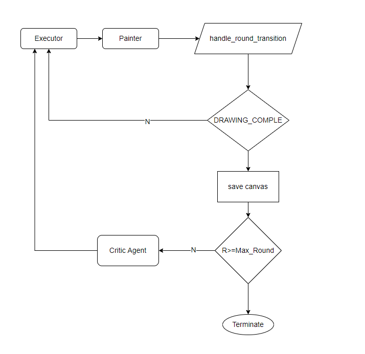

# agPainter

A two-agent system where a **Painter** agent iteratively draws a scene on a digital canvas and a **Critic** agent evaluates the rendered image visually, providing structured feedback that guides each successive round.

## Drawing Subject

> **"A beach scene with coconut trees, a sun, and a boat on the water."**

## How to Run

### 1. Install dependencies

```bash
pip install -r requirements.txt
```

### 2. Configure environment

Create a `.env` file in the project root:

```
API_PROXY=https://<your-openai-compatible-proxy-url>
```

### 3. Run

```bash
python main.py
```

Round images are saved to the `output/` folder as `round_1.png` … `round_10.png`.

---


### Agent roles

| Agent | Class | Role |
|---|---|---|
| `Painter` | `AssistantAgent` | Calls drawing tools to build the scene in each round; receives the previously rendered image + critic feedback before at the end of each round and imrpove the drawing based in it |
| `Critic` | `AssistantAgent` | Receives the actual PNG (via base64 `image_url`) and gives structured visual feedback |
| `Executor` | `UserProxyAgent` | Executes drawing tool calls made by the Painter |
| `CriticProxy` | `UserProxyAgent` | One-shot proxy that forwards the canvas image to the Critic and collects its reply |


All `NUM_ROUNDS=10` are managed inside `executor.initiate_chat(painter, ...)` call.  



This keeps orchestration inside AG2's built-in conversation mechanism rather than a manual Python loop.


### Drawing tools

Three tools are registered on the Painter via `register_for_llm` / `register_for_execution`:

| Tool | What it draws |
|---|---|
| `draw_line` | Straight lines (waves, mast, horizon, tree trunk) |
| `draw_circle` | Circles / filled disks (sun, coconuts, boat windows) |
| `draw_rectangle` | Filled rectangles (sky, sea, sand, boat hull, sail) |
| `draw_point` | Filled points |
